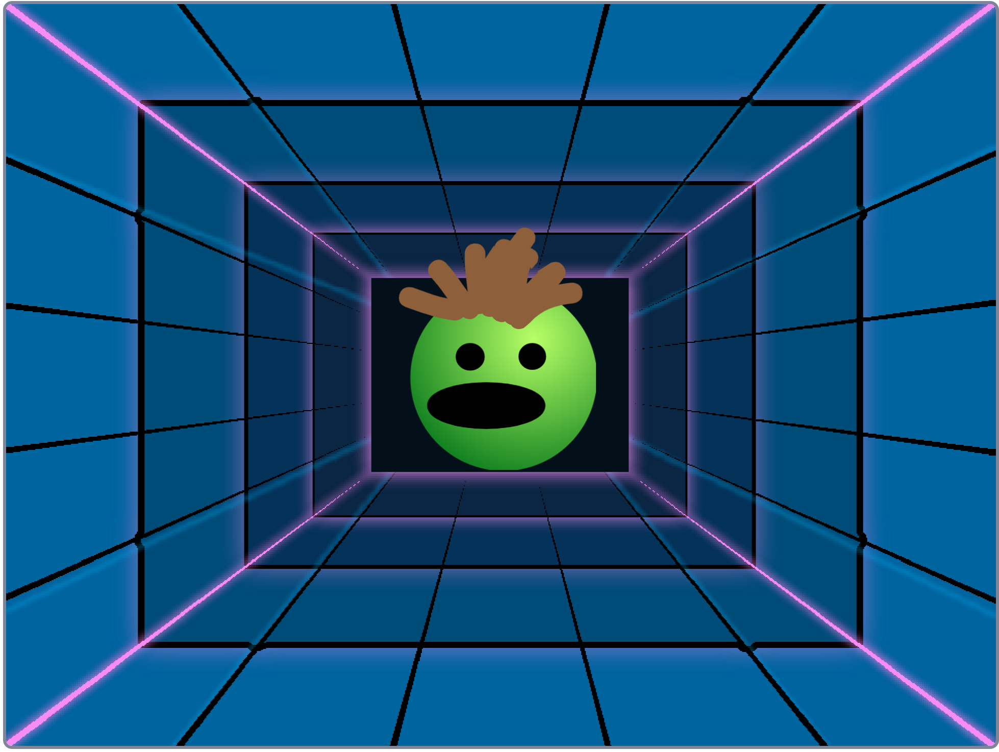

## Introduction

Use Scratch to create a stress ball that you can squish!

### What you will make

--- no-print ---
Click or tap on the stress ball to squish it and hear the sounds it makes.

  <iframe allowtransparency="true" width="485" height="402" src="https://scratch.mit.edu/projects/embed/401316899/?autostart=false" frameborder="0"></iframe>

--- /no-print ---

--- print-only ---

--- /print-only ---

--- collapse ---
---
title: What you will need
---
#### Hardware

+ A computer capable of running Scratch 3

#### Software

+ Scratch 3 (either [online](http://rpf.io/scratchon){:target="_blank"} or [offline](http://rpf.io/scratchoff){:target="_blank"})

### Downloads

+ [rpf.io/project-name-go](http://rpf.io/project-name-go){:target="_blank"}

--- /collapse ---

--- collapse ---
---
title: What you will learn
---

+ Add code to sprites and the stage
+ Use the paint tool to add details to a sprite
+ Add graphic effects and sound to a sprite

--- /collapse ---

--- collapse ---
---
title: Additional information for educators
---

If you need to print this project, please use the [printer-friendly version](https://projects.raspberrypi.org/en/projects/project-name/print){:target="_blank"}.

[Here is a link to the completed Scratch project for Stress Ball (http://rpf.io/project-name-get).

--- /collapse ---
