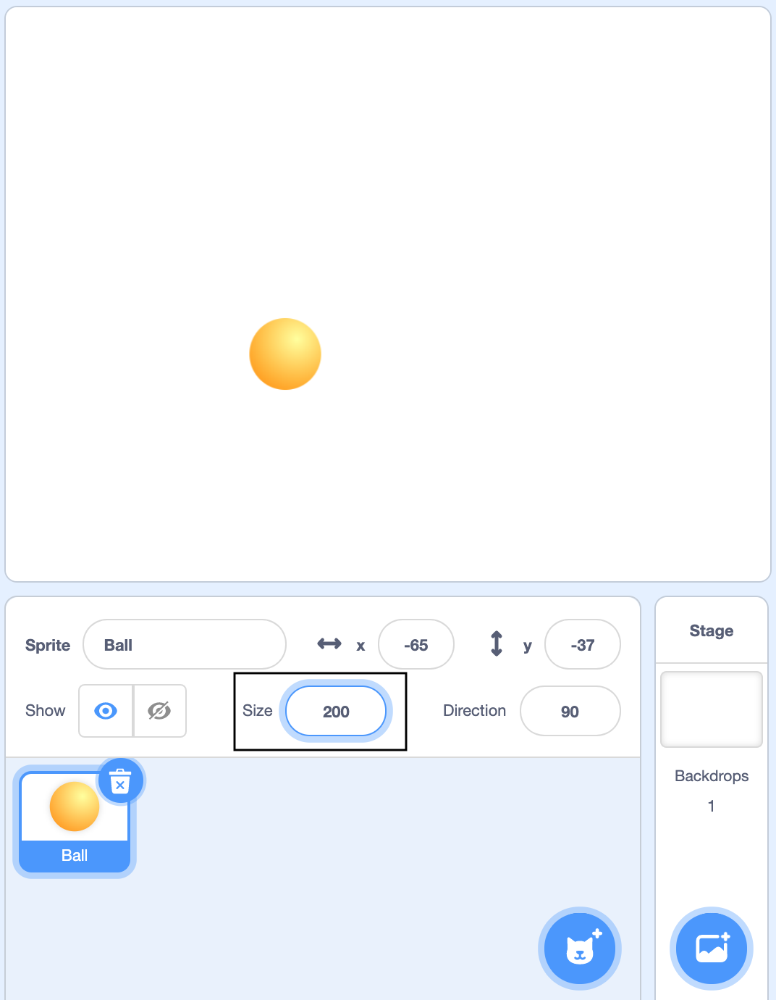

## Add a Ball sprite

In Scratch, you add code to __sprites__ which are any characters and objects in your project. You're going to create a Ball sprite and turn it into a stress ball.

--- task ---

Open a new Scratch project.

**Online:** open a new online Scratch project at [rpf.io/scratch-new](http://rpf.io/scratch-new){:target="_blank"}.

**Offline:** open a new project in the offline editor.

If you need to download and install the Scratch offline editor, you can find it at [rpf.io/scratchoff](http://rpf.io/scratchoff){:target="_blank"}.

The Scratch environment which you will open looks like this:

--- /task ---

--- task ---

The Cat sprite that you can see is the Scratch mascot. 

Watch this short video which shows what to do next.

 

Now follow each task given below.

You don't need a cat for this game, so get rid of it by right-clicking it and then clicking on **delete**.

--- /task ---

--- task ---

Next, click on **Choose a Sprite** to open up a list of all the Scratch sprites.

If you're using a tablet, tap twice on the **Choose a Sprite** cat.

--- /task ---

--- task ---

Click on the Ball sprite to add it to your project.

--- /task ---

The Ball sprite will appear on the __stage__. This is where all the action happens in your project. 

--- task ---
Drag the Ball sprite to the middle of the Stage. 

--- /task ---

The ball is a bit small. 

--- task ---
Under the stage there are some sprite settings that you can change. The 'Size' starts at 100%. To make the sprite bigger, change it to 200% - this is double the size. 

--- /task ---

--- task ---

Give your program a name by typing into the text box at the top.

Then click on **File**, and then on **Save now** to save your project.

If you are not online or don't have a Scratch account, you can save a copy of your project by clicking on **Save to your computer** instead.

--- /task ---
