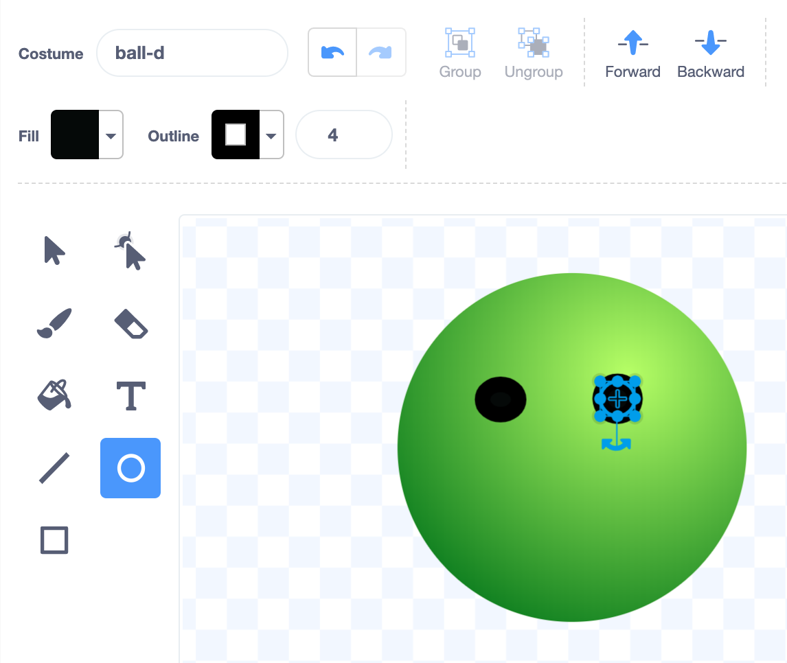
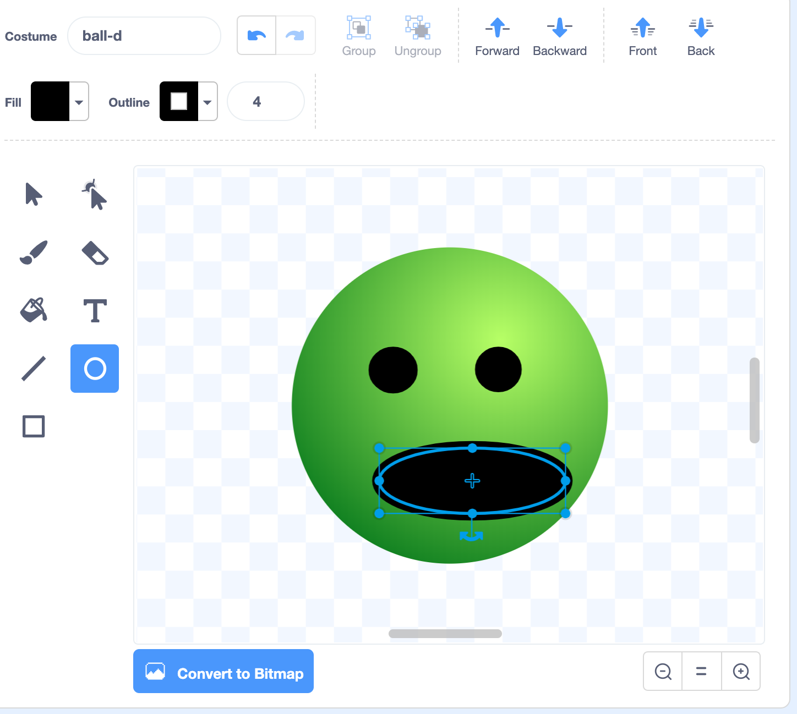

## Draw a face

In Scratch, characters and objects are called **sprites**, and they appear on the **Stage**. The picture used for a sprite is called a **costume**. 

Add a face to the **Ball** sprite to make it more interesting. 

{:width="300px"}

--- task ---

Open the [Stress ball starter project](https://scratch.mit.edu/projects/544664127/editor){:target="_blank"}. Scratch will open in another browser tab.

--- collapse ---

---
title: Working offline
---

Download the [Stress ball starter project](https://rpf.io/p/en/stress-ball-go){:target="_blank"} and open it using the offline editor.

Visit [Getting started with Scratch](https://projects.raspberrypi.org/en/projects/getting-started-scratch/1){:target="_blank"} for more information on working offline.

--- /collapse ---

--- /task ---

--- task ---

Click on the **Costumes** tab.

{:width="500px"}

--- /task ---

Now, you are in the **Paint editor**.

--- task ---
The **Ball** sprite has five different-coloured costumes. Click on the costume that you like the most.

{:width="500px"}

The **Ball** sprite on the Stage will switch to the costume that you have chosen.
--- /task ---

--- task ---
Click on the **Fill** colour chooser and drag the **Brightness** to 0 to change the **Fill** colour to black.

{:width="500px"}

--- /task ---

--- no-print ---

 

--- /no-print ---

--- task ---

Click on the **Circle** tool. 
{:width="400px"}

--- /task ---

--- task ---
Draw two eyes. 

If you are using a mouse or trackpad, hold down the left button and drag until the circle is the size and shape that you want, then release the button.

{:width="400px"}

If you make a mistake, you can click on the **Undo** arrow.

{:width="400px"}

--- /task ---

--- task ---
Use the **Circle** tool to draw a mouth.

{:width="400px"}
--- /task ---

**Tip:** To move the features that you have drawn, click on the **Select** (arrow) tool, then click on the features and drag them into position.

{:width="400px"}

--- task ---

If you are signed in to your Scratch account, type the title of your project into the project title box at the top of the screen.

**Tip:** Give your projects helpful names so that you can easily find them when you have lots of projects.

Next, click on File, and then on Save now to save your project.

--- /task ---

--- save ---
