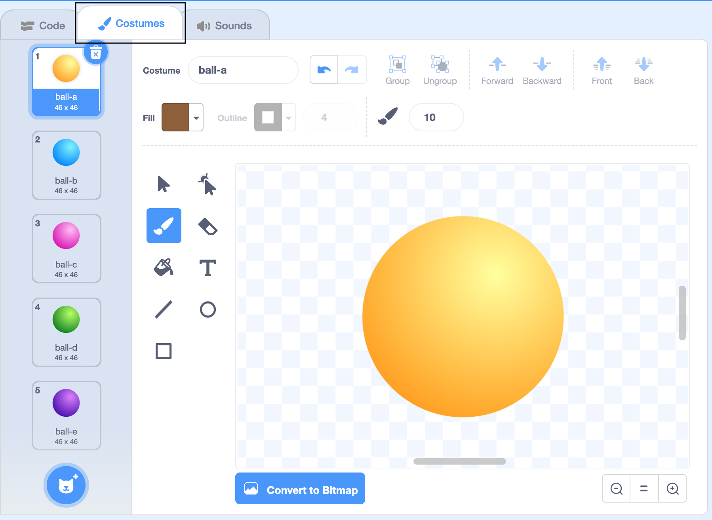
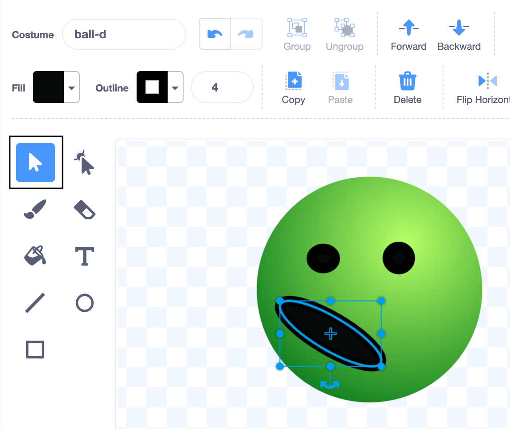

## Add a face
In Scratch, the picture used for a sprite is called a **costume**. In this step, you will add a face to the **Ball** sprite to make it more interesting. 

--- no-print ---
--- task ---
Watch this short video, which shows what to do next.

 

Now, follow the instructions for each task below.
--- /no-print ---

--- /task ---

--- task ---

Click on the **Costumes** tab.

--- /task ---

Now, you are in the **Paint editor**.

--- task ---
The **Ball** sprite has five different-coloured costumes. Click on the costume that you like the most.

The **Ball** sprite on the Stage will switch to the costume that you have chosen.
--- /task ---

--- task ---
Click on the **Fill** colour chooser and drag the **Brightness** to 0 to change the **Fill** colour to black.

--- /task ---
--- task ---

Click on the **Circle** tool. 

--- /task ---

--- task ---
Draw two eyes. 

If you are using a mouse or trackpad, hold down the left button and drag until the circle is the size and shape that you want, then release the button.

If you make a mistake, you can click on the **Undo** arrow.

--- /task ---

--- task ---
Use the **Circle** tool to draw a mouth.

--- /task ---

**Tip:** To move the features that you have drawn, click on the **Select** (arrow) tool, then click on the features and drag them into position.

--- save ---
