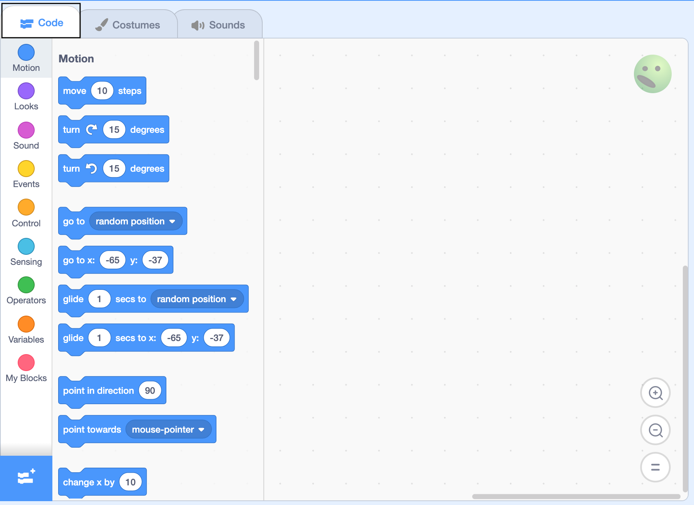
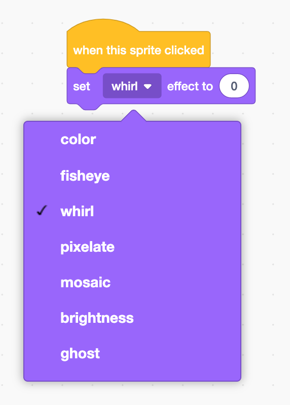
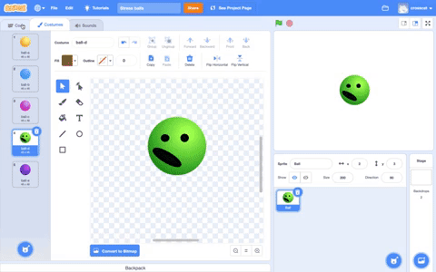
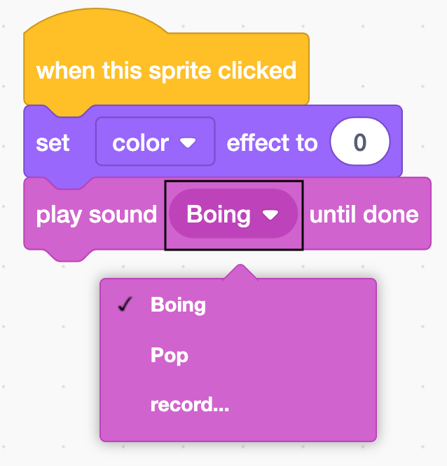

## Squash it

<div style="display: flex; flex-wrap: wrap">
<div style="flex-basis: 200px; flex-grow: 1; margin-right: 15px;">
Now, you can add code to make the stress ball look like it is being squashed when you click or tap on it. 
</div>
<div>
{:width="300px"}
</div>
</div>


--- task ---

Click on the **Code** tab.

{:width="500px"}

Now, you are in the **Code area**.

--- /task ---

--- task ---
From the `Events`{:class="block3events"} blocks menu, drag a `when this sprite clicked`{:class="block3events"} block into the Code area on the right-hand side:

{:width="500px"}

```blocks3
when this sprite clicked
```

--- /task ---

--- task ---
From the `Looks`{:class="block3looks"} blocks menu, drag a `set color effect to`{:class="block3looks"} block underneath the `when this sprite clicked`{:class="block3events"} block and make sure that they connect together:

```blocks3
when this sprite clicked
+set [color v] effect to (0)
```

Notice that the colour of each block tells you where you can find it. 

--- /task ---

--- task ---
Click on `color`{:class="block3looks"} and change it to `whirl`{:class="block3looks"}.

{:width="300px"}

Your code should look like this:

```blocks3
when this sprite clicked
+set [whirl v] effect to (0)
```

--- /task ---
--- no-print ---

 

--- /no-print ---
--- task ---
Change the value from `0` to `100`:

```blocks3
when this sprite clicked
+set [whirl v] effect to (100)
```

This will create lots of whirl!

--- /task ---

--- task ---
Add a `play sound Pop until done`{:class="block3sound"} block:

```blocks3
when this sprite clicked
set [whirl v] effect to (100)
+play sound [Pop v] until done
```
--- /task ---

--- task ---
Click on `Pop`{:class="block3sound"} and change it to `Boing`{:class="block3sound"}:

{:width="300px"}

```blocks3
when this sprite clicked
set [whirl v] effect to (100)
+play sound [Boing v] until done
```
--- /task ---

--- task ---
Click on your stress ball to see it whirl and then play the sound.

{:width="150px"}

--- /task ---

--- task ---
Click on `Looks`{:class="block3looks"}, then click on the `clear graphic effects`{:class="block3looks"} block in the Blocks menu to remove the whirl effect. You might need to scroll down to find the block.

{:width="300px"}
--- /task ---

--- task ---
Now, add a `clear graphic effects`{:class="block3looks"} block to the bottom of your code so that the ball always returns to its original state after it has been squashed: 

```blocks3
when this sprite clicked
set [whirl v] effect to (100)
play sound [Boing v] until done
+ clear graphic effects
```
--- /task ---

--- task ---
Check carefully that your code looks exactly like this:

```blocks3
when this sprite clicked
set [whirl v] effect to (100)
play sound [Boing v] until done
clear graphic effects
```

--- /task ---

<p style="border-left: solid; border-width:10px; border-color: #0faeb0; background-color: aliceblue; padding: 10px;">
**Laughing** and being **artistic** are good ways to get rid of stress.
</p>

--- task ---
Click on your sprite to try it out. Try it again. Then, try it again!
--- /task ---

--- save ---
