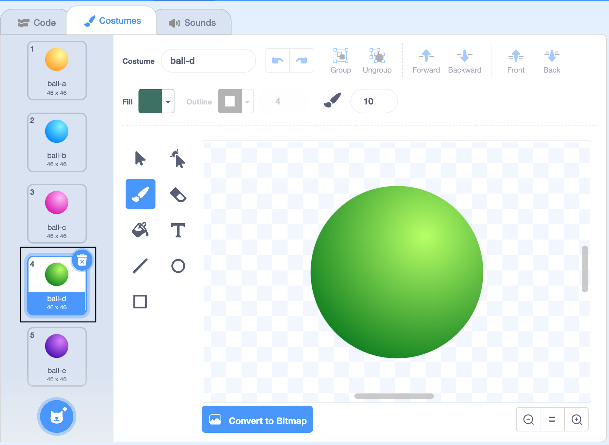
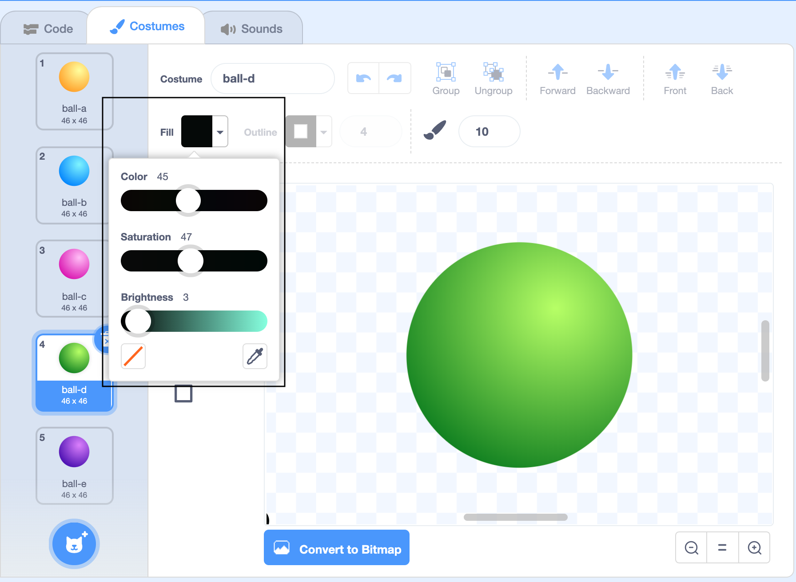
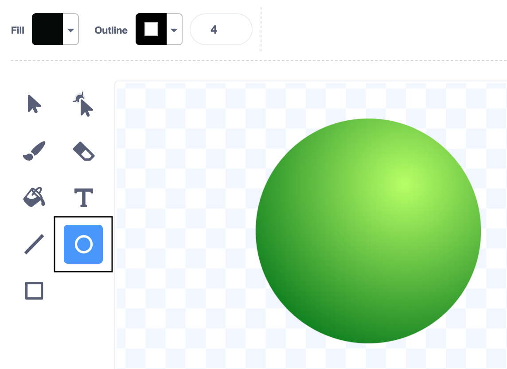
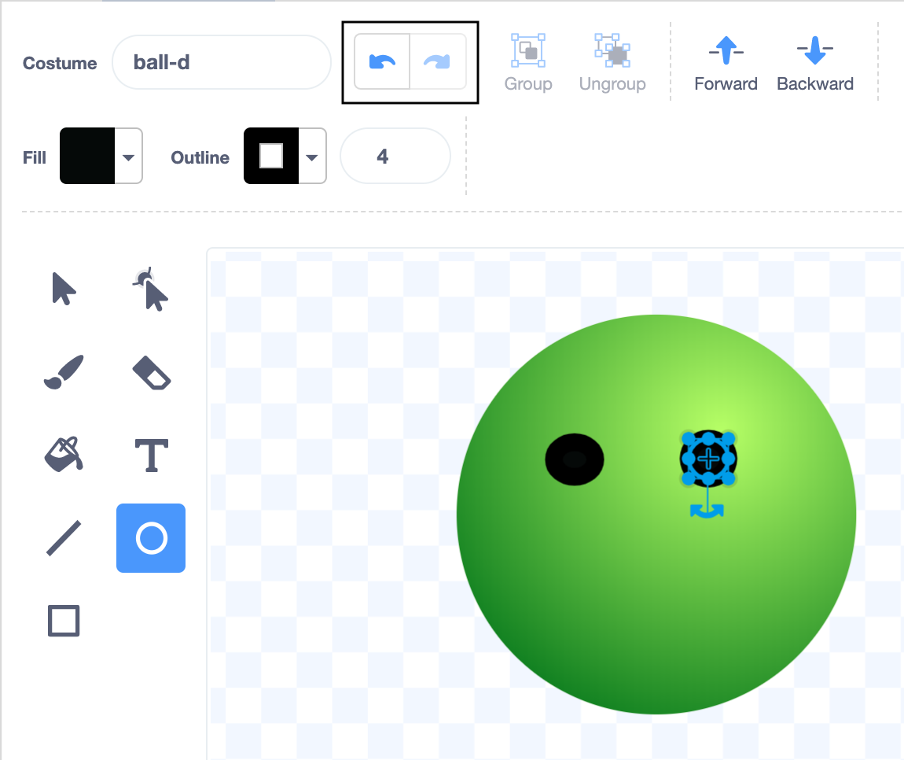

## Add a face
In Scratch, the picture used for a sprite is called a __costume__. You're going to add a face to Ball sprite to make it more interesting. 

--- no-print ---
Watch this short video which shows what to do next.

 

Now follow each task given below.
--- /no-print ---

--- task ---

Click on the **Costumes** tab

--- /task ---

Now you are in the Paint Editor.

--- task ---
The Ball sprite has five different coloured costumes. Click on the one you like best.

The ball sprite on the stage will switch to the costume you have chosen.
--- /task ---

--- task ---
Click on the Fill colour chooser and change the Fill colour to black by dragging the Brightness all the way down to 0.

--- /task ---
--- task ---

Click on the Circle tool. 

--- /task ---

--- task ---
Draw two eyes. 

If you're using a mouse or trackpad then hold down the left button and drag until the circle is the size and shape you want.

If you make a mistake then you can click the Undo arrow.

--- /task ---

--- task ---
Use the circle tool to draw a mouth.

--- /task ---

__Tip:__ Click on the Move (arrow) tool then you will be able to move the features you have drawn.

