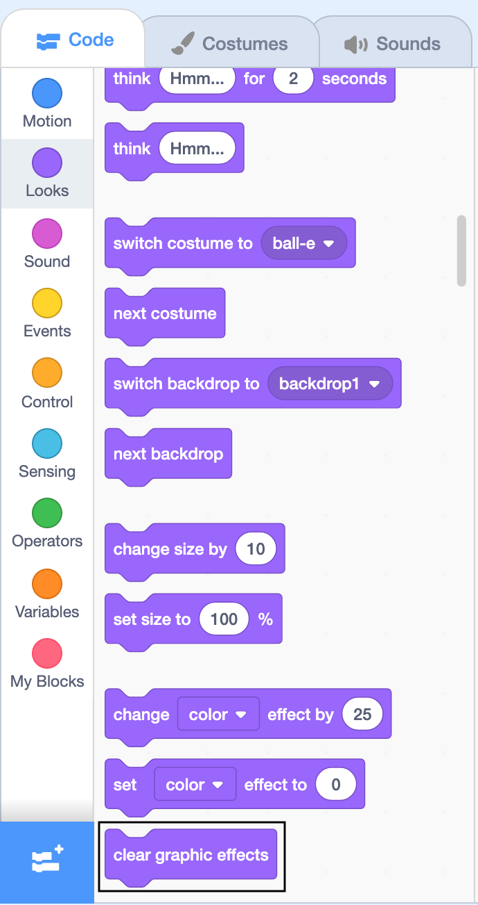

## Squish it
Now you can add code to make the stress ball look like it's being squished when you click or tap on it. 

--- task ---

Click on the **Code** tab


--- /task ---

Now you are in the Code Editor.

--- task ---
Click on the Ball sprite, and then drag a `when this sprite clicked`{:class="block3events"} block, from `Events`{:class="block3events"} into the code area on the right:

```blocks3
when this sprite clicked
```

--- /task ---

--- task ---
Drag a `set color effect to`{:class="block3looks"} block underneath the `when this sprite clicked`{:class="block3events"} block and make sure it 'snaps' into place: 

```blocks3
when this sprite clicked
+set [color v] effect to (0)
```

The colour of each block tells you where to find it. 

--- /task ---

--- task ---
Click on `color`{:class="block3looks"} and change it to `whirl`{:class="block3looks"}.

{:width="350px"}

Your code should look like this:

```blocks3
when this sprite clicked
+set [whirl v] effect to (0)
```

--- /task ---

--- task ---
Click in the `0` box and change the value to `100` (lots of whirl)

```blocks3
when this sprite clicked
+set [whirl v] effect to (100)
```
--- /task ---

--- task ---
Add a `play sound until done`{:class="block3sound"} block.

```blocks3
when this sprite clicked
set [whirl v] effect to (100)
+play sound [Pop v] until done
```
--- /task ---

--- task ---
Click on `Pop`{:class="block3sound"} and change it to `Boing`{:class="block3sound"}.

{:width="350px"}

```blocks3
when this sprite clicked
set [whirl v] effect to (100)
+play sound [Boing v] until done
```
--- /task ---

--- task ---
Click on your stress ball to see it shrink and get whirled and then play the sound.


--- /task ---

--- task ---
Click on `Looks`{:class="block3looks"} and then click on `clear graphic effects`{:class="block3looks"} in the editor to remove the whirl effect. You might need to scroll down to find the block.

{:width="350px"}
--- /task ---

--- task ---
Now add a `clear graphic effects`{:class="block3looks"} to the bottom of your code so that it returns to normal every time you click on the Ball. 

```blocks3
when this sprite clicked
set [whirl v] effect to (100)
play sound [Boing v] until done
+ clear graphic effects
```
--- /task ---

--- task ---
Check carefully that your code looks exactly like this:

```blocks3
when this sprite clicked
set [whirl v] effect to (100)
play sound [Boing v] until done
clear graphic effects
```

--- /task ---

--- task ---
Click on your sprite to try it out. Try it again. And again. 
--- /task ---

