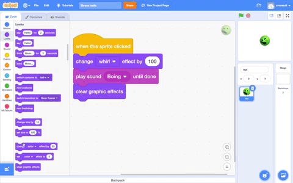
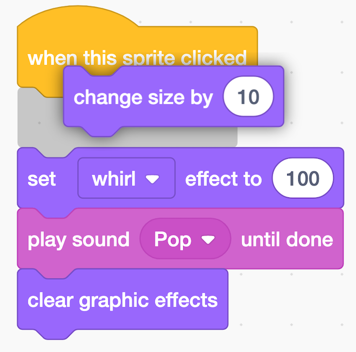

## Shrink it

Now you're going to make Ball sprite shrink as well as squish when you click on it.

--- no-print ---
Watch this short video which shows what to do next.

 

Now follow each task given below.
--- /no-print ---


--- task ---
Drag a `change size by`{:class="block3looks"} block under your `when this sprite clicked`{:class="block3events"}. A space will open up for the block and it will snap into place. 

{:width="350px"}

Your code should look like this:
```blocks3
when this sprite clicked
+change size by (10)
set [whirl v] effect to (100)
play sound [Boing v] until done
clear graphic effects
```
--- /task ---

--- task ---
You want the Ball sprite to get smaller when you click it so change the number in the `change size by`{:class="block3looks"} block from `10` to `-50`. Choosing a negative number will make Ball sprite shrink.

```blocks3
when this sprite clicked
+change size by (-50)
set [whirl v] effect to (100)
play sound [Boing v] until done
clear graphic effects
```
--- /task ---

--- task ---
Now add a `set size to`{:class="block3looks"} block to the bottom of your code and set Ball sprite back to **200**%. 

```blocks3
when this sprite clicked
change size by (-50)
set [whirl v] effect to (100)
play sound [Boing v] until done
clear graphic effects
+set size to (200)
```

--- /task ---

--- task ---
Click on your stress ball to see if it is working correctly. 

--- /task ---

__Tip:__ If you are logged in to Scratch then your project will automatically save, you can also use **File** then **Save now**. If you don't have an account or you are working offline then remember to use **File** then **Save** when you make an important change. 
