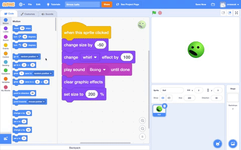
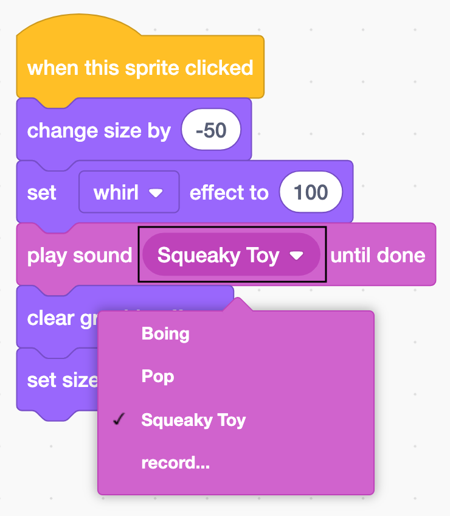

## Add a better sound effect

Now, you will add a better sound effect to your stress ball.

--- no-print ---
Watch this short video, which shows what to do next.

 

Now, follow each task given below.
--- /no-print ---

--- task ---
Click on the **Sounds** tab.


--- /task ---

--- task ---
Click on **Choose a Sound**.


--- /task ---

--- task ---
Click on **Wacky**.


--- /task ---

--- task ---
Click on the **Play** button for the **Squeaky Toy** sound to hear it. 


Then, click on **Squeaky Toy** to add the sound to the **Ball** sprite. Now, you can use this sound in your code.

--- /task ---

--- task ---
Click on the **Code** tab to return to the code editor. 

Click on `Boing`{:class="block3sound"} in the `play sound until done`{:class="block3sound"} block and change it to `Squeaky Toy`{:class="block3sound"}.

{:width="350px"}

Your code should look like this:

```blocks3
when this sprite clicked
change size by (-50)
set [whirl v] effect to (100)
+play sound [Squeaky Toy v] until done
clear graphic effects
set size to (200)
```
--- /task ---

--- task ---
Click on your stress ball again to try out the new sound effect. 
--- /task ---

--- save ---
