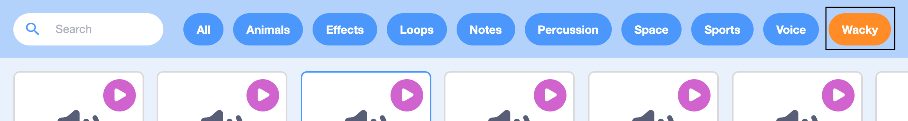

## Add a better sound effect

Now you're going to add a better sound effect to your stress ball. 

--- task ---
Click on your new ball sprite and then click on the Sounds tab.


--- /task ---

--- task ---
Click on **Choose a sound**.


--- task ---
Click on 'Wacky'.



--- /task ---

--- task ---
Click on the play button for the Squeak Toy sound to hear it. 


Then click on 'Squeaky Toy' to add the sound to the Ball sprite. Now you can use this sound in your code.

--- /task ---

--- task ---
Click on the **Code** tab to return to the code editor. 

Click on `Boing`{:class="block3sound"} in the `play sound until done`{:class="block3sound"} block and change it to `Squeaky Toy`{:class="block3sound"}.

Your code should look like this:

```blocks3
when this sprite clicked
set [whirl v] effect to (100)
play sound [Squeaky Toy v] until done
clear graphic effects
```
