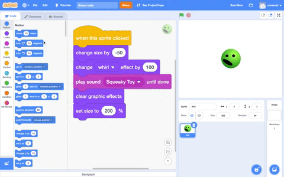
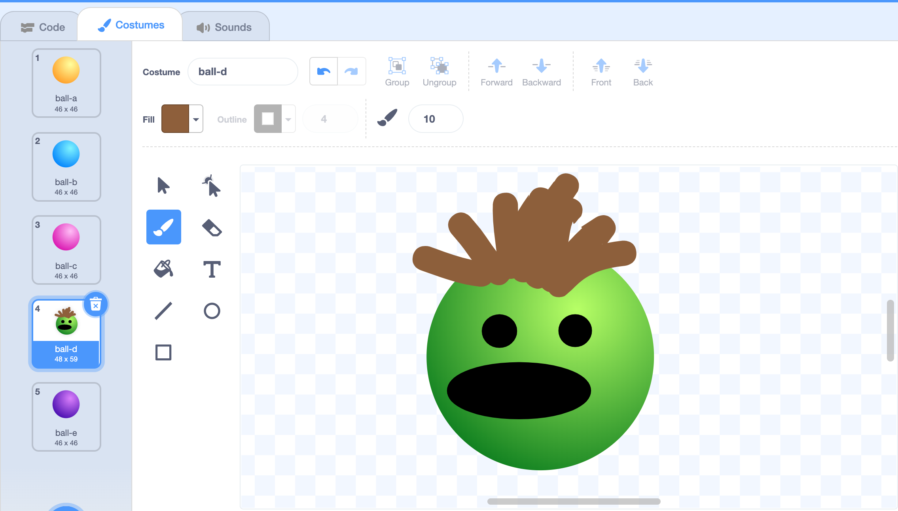
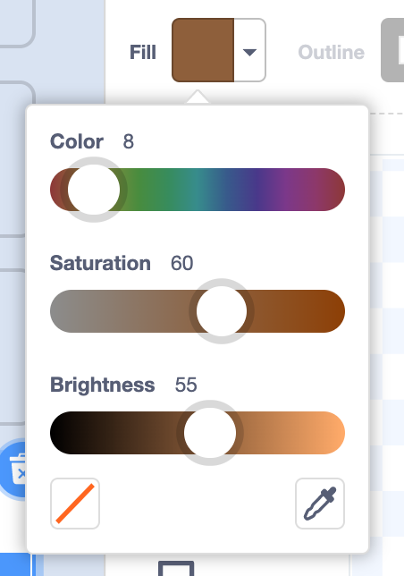

## Addmore

Improve your stress ball. 

Use the **Brush** tool or other tools in the Paint editor to add hair and other features.

--- no-print ---
Watch this short video, which shows what to do next.

 

Now, follow the instructions for each task below.
--- /no-print ---

You can change the colour using the sliders. 

Try to find a different sound that works well. 

Change the size that your stress ball shrinks and grows to.

Try the `fisheye`{:class="block3looks"} effect instead of `whirl`{:class="block3looks"}. You could also find out what happens if you choose negative numbers.

