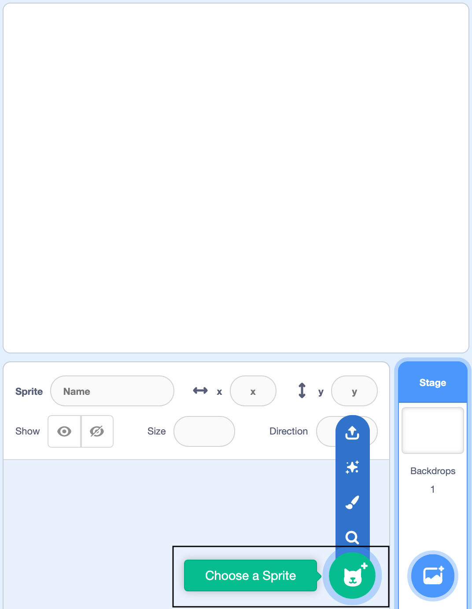
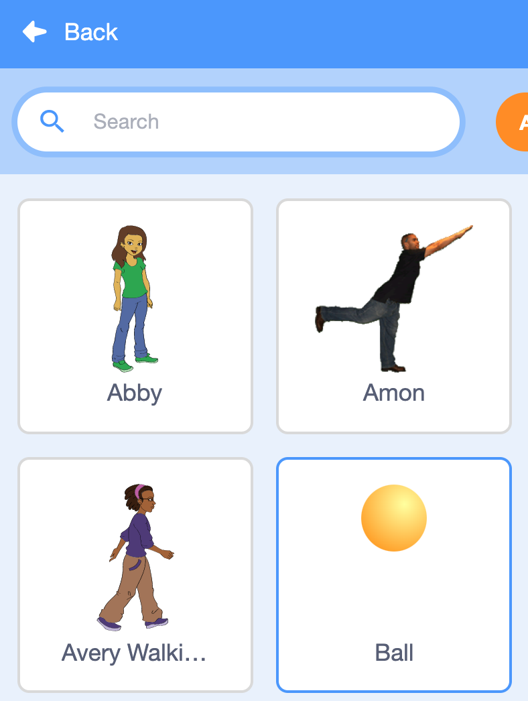

## Add another stress ball

<div style="display: flex; flex-wrap: wrap">
<div style="flex-basis: 200px; flex-grow: 1; margin-right: 15px;">
One stress ball is fun but having more stress balls is even better. You will add your own **Ball** sprite and turn it into another stress ball. 

What will this one look and sound like?
</div>
<div>
{:width="300px"}
</div>
</div>

--- task ---

Click on **Choose a Sprite** to open the Sprite Library.

If you are using a tablet, tap twice on the **Choose a Sprite** button.

{:width="400px"}

--- /task ---

--- task ---

Click on the **Ball** sprite to add it to your project.

{:width="300px"}

--- /task ---

--- task ---
Drag the **Ball** sprite to a good position on the Stage.

{:width="400px"}

--- /task ---

The ball is a bit small.

--- task ---
Below the Stage, there are some sprite settings that you can change. The size starts at `100` (percent). To make the sprite bigger, change it to `200` — this is double the size.  

{:width="400px"}

--- /task ---

--- task ---

Click on the **Costumes** tab to choose a colour for your new stress ball.

{:width="500px"}

--- /task ---

--- task ---

Use the **Fill** , **Circle** and **Select** tools to draw a face on your new stress ball.

If you need a reminder, look back at the [Draw a face](https://projects.raspberrypi.org/en/projects/stress-ball/2) step.

--- /task ---

--- task ---

Click on the **Sounds** tab to add a sound to your new stress ball.

If you need a reminder, look back at the [Choose your own sound effect](https://projects.raspberrypi.org/en/projects/stress-ball/5) step.

--- /task ---

--- task ---

Click on the **Code** tab and add this code to your new stress ball. 

```blocks3
when this sprite clicked
change size by (-50) // try different numbers
set [whirl v] effect to (100) // try different effects
+play sound [Pop v] until done // change this to your sound
clear graphic effects
set size to (200)%
```

--- /task ---

--- save ---
