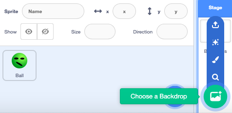
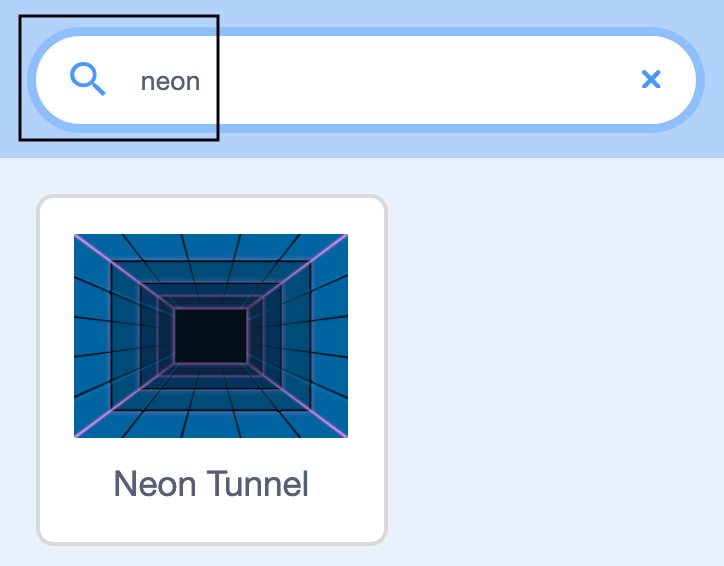
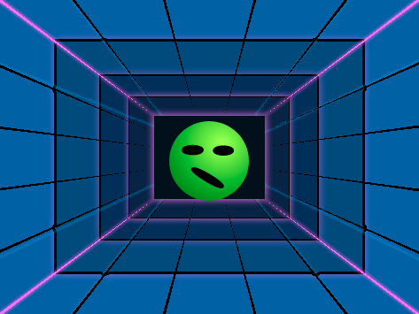

## Add a backdrop

Now you will add a colourful backdrop to your project.

--- task ---
At the moment, the stage is white and boring! 

--- no-print ---
Watch this short video which shows what to do next.

 

Now follow each task given below.
--- /no-print ---

Add a backdrop to it by clicking on **Choose a Backdrop**.

--- /task ---

--- task ---

Type in 'neon' or scroll down until you see the 'Neon Tunnel' backdrop and then click on it. The backdrops are in alphabetical order. 

--- /task ---

--- task ---

Your stage should now look similar to this:

--- /task ---
