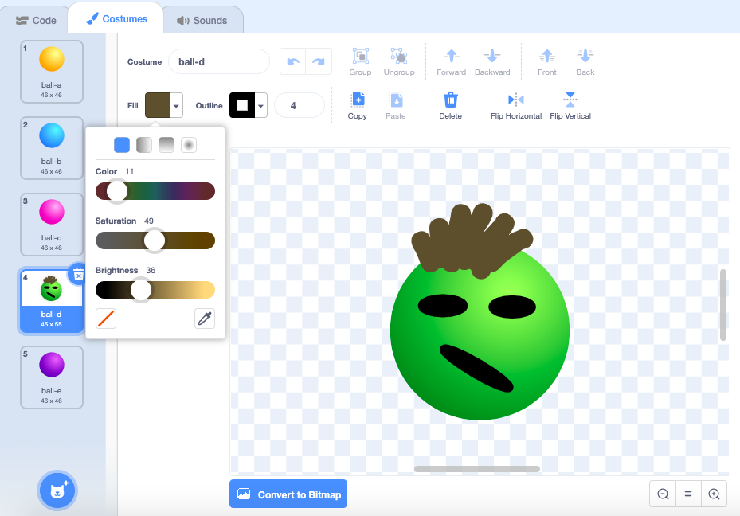

## Improve your stress balls

Use the **Brush** tool or other tools in the Paint editor to add hair and other features.

{:width="300px"}

--- no-print ---
Watch this short video, which shows what to do next.

--- /no-print ---

You can change the colour using the sliders.

{:width="500px"}

Try to find a different sound that works well.

Change the size that your stress ball shrinks and grows to.

Try the `fisheye`{:class="block3looks"} effect instead of `whirl`{:class="block3looks"}. You could also find out what happens if you choose negative numbers.

Use what you have learned to add even more stress toys to your project. You do not have to start from the **Ball** sprite. Add a different sprite to your project and see what happens when you add graphic effects to it.

--- no-print ---
Here is an example:

  <iframe src="https://scratch.mit.edu/projects/403409939/embed" allowtransparency="true" width="485" height="402" frameborder="0" scrolling="no" allowfullscreen></iframe>

--- /no-print ---

--- print-only ---

--- /print-only ---

__Tip:__ Make sure that you **Save** your project.

--- task ---

Inspire the [Raspberry Pi Foundation](https://projects.raspberrypi.org/en){:target="_blank"} community with your project!

To submit your project to our new ['Stress ball — Community' Scratch studio](https://scratch.mit.edu/studios/29934771){:target="_blank"}, please complete [this form](https://form.raspberrypi.org/f/community-project-submissions){:target="_blank"}.

--- /task ---

--- save ---
