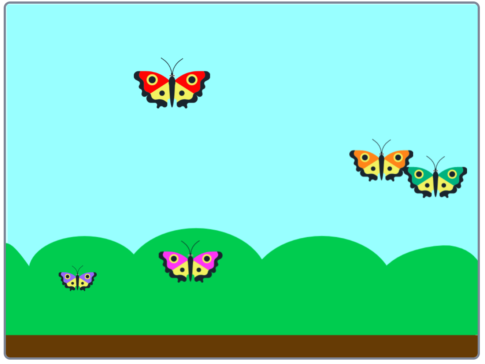

## What can you do now?

If you are following the [Look after yourself](https://projects.raspberrypi.org/en/pathways/look-after-yourself) projects, then try out the project [Butterfly garden](https://projects.raspberrypi.org/en/projects/butterfly-garden).

--- print-only ---

--- /print-only ---

--- no-print ---

  <iframe allowtransparency="true" width="485" height="402" src="https://scratch.mit.edu/projects/embed/403091557/?autostart=false" frameborder="0"></iframe>

--- /no-print ---

If you want to have more fun exploring Scratch, then you could try out any of [these projects](https://projects.raspberrypi.org/en/projects?software%5B%5D=scratch&curriculum%5B%5D=%201).
