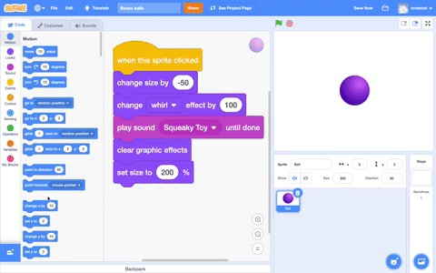
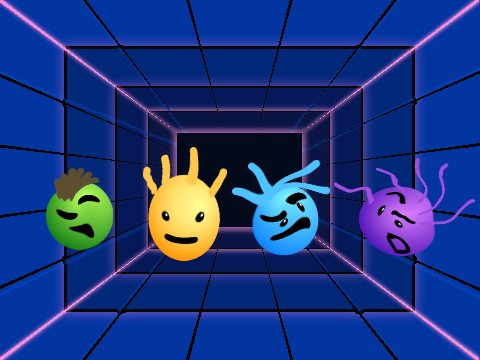

## Challenge: Improve your project

Use what you've learned to add more stress toys to your project. 

--- no-print ---
Watch this short video for a reminder:

 
--- /no-print ---

Now follow each task given below.

You don't have to start from the Ball sprite. Try adding a different sprite to your project and see what happens when you add graphics effects to it. 

Try choosing a different backdrop.

--- no-print ---
Here's an example:

  <iframe src="https://scratch.mit.edu/projects/403409939/embed" allowtransparency="true" width="485" height="402" frameborder="0" scrolling="no" allowfullscreen></iframe>

--- /no-print ---

--- print-only ---

--- /print-only ---

__Tip:__ Make sure you **Save** your project.
